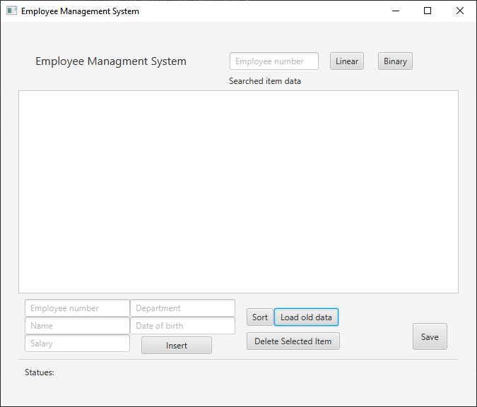

# very-simple-CRUD-operations-with-JavaFX

## Employee manager with CRUD operations (Create, Read, Update, Delete)

    I have build the project with Java & JavaFX
    using IntelliJ IDEA IDE Community edition, you can download the project and use the same IDE without getting errors.

    The program based on txt file not database

## preview image

